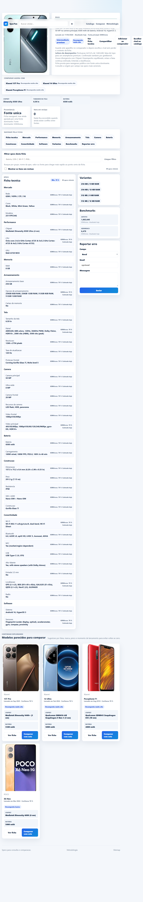
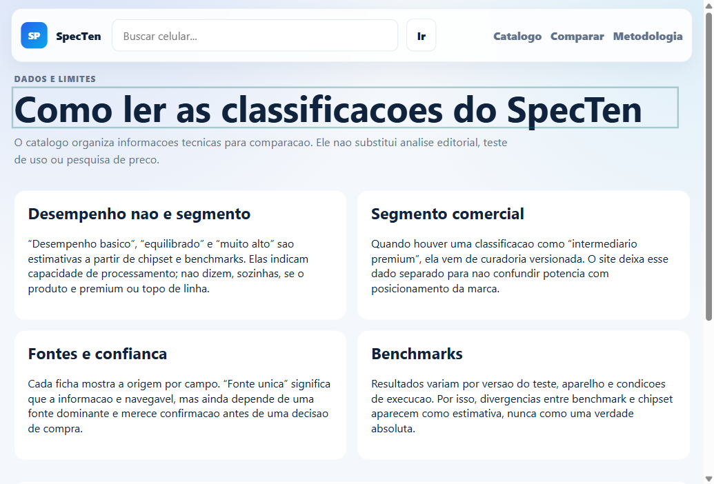

# SpecTen

Blazor Web App em `.NET 9` para catalogar celulares com specs, fontes, score de confianca, classificador por benchmark/chipset e comparacao publica.

## Stack

- ASP.NET Core / Blazor Web App `net9.0`
- EF Core + PostgreSQL via Npgsql
- Minimal APIs para busca, comparacao e reportes
- BackgroundService opcional para importacao diaria
- Dockerfile pronto para Railway

## Rodar localmente

Configure um PostgreSQL local:

```text
Host=localhost;Port=5432;Database=specten;Username=postgres;Password=postgres
```

Depois:

```bash
dotnet restore
dotnet test
dotnet run --project src/SpecTen.Web
```

O ambiente de desenvolvimento pode usar adapters de fixture. Por seguranca, a configuracao versionada inicia somente com o seed local: cobertura remota e hidratacao sob demanda ficam desligadas ate que quem fizer o fork as habilite conscientemente.

## Railway

O Railway precisa do `Dockerfile` porque o deploy .NET usa container. O `railway.json` na raiz seleciona o Dockerfile correto e configura `/health`. Adicione um PostgreSQL ao projeto e defina:

```text
DATABASE_URL=postgresql://...
Scraping__Enabled=false
Scraping__UseFixtureAdapters=false
Scraping__DailyUtcHour=6
Scraping__UserAgent=SpecTenBot/1.0 (+https://seu-dominio/robots.txt)
Coverage__Enabled=true
Coverage__OnDemandHydrationEnabled=true
Coverage__MakerPageLimit=24
Coverage__MakerPageDelayMilliseconds=250
Coverage__CatalogEntryRefreshHours=168
```

Mantenha `Scraping__Enabled=false` ate registrar e revisar permissao, robots e limites das fontes que serao ativadas. O app le `PORT` automaticamente e expoe `/health`.

## Busca sob demanda e cache

O fluxo publico recomendado para o SpecTen fica assim:

- `PostgreSQL` continua sendo a fonte de verdade do catalogo publicado.
- A busca publica tenta o banco primeiro e usa cobertura remota quando o modelo nao existe ou quando a ficha local esta velha, incompleta ou suspeita.
- Quando a cobertura remota encontra um aparelho valido, a ficha entra no banco e passa a responder como catalogo persistido nas proximas consultas.
- O cache local so acelera leitura. Ele nao decide verdade de dados e eh limpo apos importacoes e hidratacoes relevantes.

Redis faz sentido quando voce tiver mais de uma instancia web ou muito trafego de busca. Nessa fase ele entra para compartilhar cache quente entre instancias e reduzir repeticao de consultas externas. Ele nao substitui o banco nem a logica de proveniencia.

## Uso local e fontes remotas

O projeto nao contem chaves de API, tokens ou segredos. Por padrao, ele roda apenas com `Data/catalog-seed.json` e nao faz chamadas de descoberta/hidratacao remota. Quem fizer um fork e quiser ativar cobertura externa deve definir explicitamente `Coverage__Enabled=true` e `Coverage__OnDemandHydrationEnabled=true`, revisar permissao, `robots.txt` e limites da fonte escolhida.

## Metodologia de classificacao

Os selos automáticos descrevem **desempenho estimado** — basico, equilibrado ou muito alto — a partir de chipset e benchmarks. Eles nao sao uma declaracao de segmento comercial. Quando o catalogo exibe um segmento como “intermediario premium”, ele vem de uma pequena curadoria versionada e fica separado do desempenho. A pagina `/metodologia` explica fontes, confianca e limites dos benchmarks.

## Evidencia da ultima versao publicada

Validado em 11/07/2026 no ambiente de producao:

- URL de validacao atual: `https://spec-ten-production.up.railway.app`.
- `GET /health` respondeu `200` com o PostgreSQL alcancavel.
- `GET /api/search?query=poco%20x8%20pro` retornou `Desempenho muito alto` como desempenho e `Intermediario premium` como segmento comercial.
- `GET /metodologia` respondeu `200` e exibiu a explicacao dos limites da classificacao.





## Pesquisa local e credenciais

O modo local padrao nao usa API key nem token do autor. Ele inicia com o seed versionado em `Data/catalog-seed.json`, grava as fichas no PostgreSQL configurado pelo proprio usuario e deixa `Coverage:Enabled` e `Coverage:OnDemandHydrationEnabled` desativados.

Assim, um fork nao faz chamadas externas automaticamente. Se alguem quiser criar um provider que exija credencial, a chave deve ser fornecida por variavel de ambiente ou secret do proprio ambiente — nunca adicionada ao codigo ou ao README. Os providers atuais de cobertura publica nao exigem API key; eles so devem ser ativados conscientemente por quem estiver rodando a instancia.

## Fontes

O catalogo usa cobertura versionada para descoberta e provedores oficiais para enriquecimento sob demanda. Adapters de terceiros permanecem como fixtures enquanto permissao de uso, robots, limite de taxa e politica de imagens nao estiverem aprovados para execucao automatica.

## Nota de versao

O projeto fixa `.NET 9` por compatibilidade com o ambiente atual. Planeje migrar para `.NET 10 LTS` antes do fim de suporte do .NET 9.
